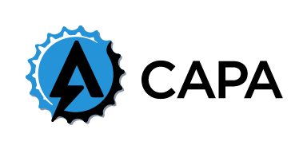

[](https://github.com/fireeye/capa/actions?query=workflow%3ACI+event%3Apush+branch%3Amaster)
[](https://github.com/fireeye/capa-rules)
[](LICENSE.txt)

capa detects capabilities in executable files.
You run it against a PE file or shellcode and it tells you what it thinks the program can do.
For example, it might suggest that the file is a backdoor, is capable of installing services, or relies on HTTP to communicate.

Check out the overview in our first [capa blog post](https://www.fireeye.com/blog/threat-research/2020/07/capa-automatically-identify-malware-capabilities.html).

```
$ capa.exe suspicious.exe

+------------------------+--------------------------------------------------------------------------------+
| ATT&CK Tactic          | ATT&CK Technique                                                               |
|------------------------+--------------------------------------------------------------------------------|
| DEFENSE EVASION        | Obfuscated Files or Information [T1027]                                        |
| DISCOVERY              | Query Registry [T1012]                                                         |
|                        | System Information Discovery [T1082]                                           |
| EXECUTION              | Command and Scripting Interpreter::Windows Command Shell [T1059.003]           |
|                        | Shared Modules [T1129]                                                         |
| EXFILTRATION           | Exfiltration Over C2 Channel [T1041]                                           |
| PERSISTENCE            | Create or Modify System Process::Windows Service [T1543.003]                   |
+------------------------+--------------------------------------------------------------------------------+

+-------------------------------------------------------+-------------------------------------------------+
| CAPABILITY                                            | NAMESPACE                                       |
|-------------------------------------------------------+-------------------------------------------------|
| check for OutputDebugString error                     | anti-analysis/anti-debugging/debugger-detection |
| read and send data from client to server              | c2/file-transfer                                |
| execute shell command and capture output              | c2/shell                                        |
| receive data (2 matches)                              | communication                                   |
| send data (6 matches)                                 | communication                                   |
| connect to HTTP server (3 matches)                    | communication/http/client                       |
| send HTTP request (3 matches)                         | communication/http/client                       |
| create pipe                                           | communication/named-pipe/create                 |
| get socket status (2 matches)                         | communication/socket                            |
| receive data on socket (2 matches)                    | communication/socket/receive                    |
| send data on socket (3 matches)                       | communication/socket/send                       |
| connect TCP socket                                    | communication/socket/tcp                        |
| encode data using Base64                              | data-manipulation/encoding/base64               |
| encode data using XOR (6 matches)                     | data-manipulation/encoding/xor                  |
| run as a service                                      | executable/pe                                   |
| get common file path (3 matches)                      | host-interaction/file-system                    |
| read file                                             | host-interaction/file-system/read               |
| write file (2 matches)                                | host-interaction/file-system/write              |
| print debug messages (2 matches)                      | host-interaction/log/debug/write-event          |
| resolve DNS                                           | host-interaction/network/dns/resolve            |
| get hostname                                          | host-interaction/os/hostname                    |
| create a process with modified I/O handles and window | host-interaction/process/create                 |
| create process                                        | host-interaction/process/create                 |
| create registry key                                   | host-interaction/registry/create                |
| create service                                        | host-interaction/service/create                 |
| create thread                                         | host-interaction/thread/create                  |
| persist via Windows service                           | persistence/service                             |
+-------------------------------------------------------+-------------------------------------------------+
```

# download and usage

Download stable releases of the standalone capa binaries [here](https://github.com/fireeye/capa/releases). You can run the standalone binaries without installation. capa is a command line tool that should be run from the terminal.

<!--
Alternatively, you can fetch a nightly build of a standalone binary from one of the following links. These are built using the latest development branch.
- Windows 64bit: TODO
- Linux: TODO
- OSX: TODO
-->

To use capa as a library or integrate with another tool, see [doc/installation.md](doc/installation.md) for further setup instructions.

For more information about how to use capa, see [doc/usage.md](doc/usage.md).

# example

In the above sample output, we ran capa against an unknown binary (`suspicious.exe`),
and the tool reported that the program can send HTTP requests, decode data via XOR and Base64,
install services, and spawn new processes.
Taken together, this makes us think that `suspicious.exe` could be a persistent backdoor.
Therefore, our next analysis step might be to run `suspicious.exe` in a sandbox and try to recover the command and control server.

By passing the `-vv` flag (for very verbose), capa reports exactly where it found evidence of these capabilities.
This is useful for at least two reasons:

  - it helps explain why we should trust the results, and enables us to verify the conclusions, and
  - it shows where within the binary an experienced analyst might study with IDA Pro

```
λ capa.exe suspicious.exe -vv
...
execute shell command and capture output
namespace   c2/shell
author      matthew.williams@fireeye.com
scope       function
att&ck      Execution::Command and Scripting Interpreter::Windows Command Shell [T1059.003]
references  https://docs.microsoft.com/en-us/windows/win32/api/processthreadsapi/ns-processthreadsapi-startupinfoa
examples    Practical Malware Analysis Lab 14-02.exe_:0x4011C0
function @ 0x10003A13
  and:
    match: create a process with modified I/O handles and window @ 0x10003A13
      and:
        or:
          api: kernel32.CreateProcess @ 0x10003D6D
        number: 0x101 @ 0x10003B03
        or:
          number: 0x44 @ 0x10003ADC
        optional:
          api: kernel32.GetStartupInfo @ 0x10003AE4
    match: create pipe @ 0x10003A13
      or:
        api: kernel32.CreatePipe @ 0x10003ACB
    or:
      string: cmd.exe /c  @ 0x10003AED
...
```

capa uses a collection of rules to identify capabilities within a program.
These rules are easy to write, even for those new to reverse engineering.
By authoring rules, you can extend the capabilities that capa recognizes.
In some regards, capa rules are a mixture of the OpenIOC, Yara, and YAML formats.

Here's an example rule used by capa:

```yaml
rule:
  meta:
    name: hash data with CRC32
    namespace: data-manipulation/checksum/crc32
    author: moritz.raabe@fireeye.com
    scope: function
    examples:
      - 2D3EDC218A90F03089CC01715A9F047F:0x403CBD
      - 7D28CB106CB54876B2A5C111724A07CD:0x402350  # RtlComputeCrc32
  features:
    - or:
      - and:
        - mnemonic: shr
        - number: 0xEDB88320
        - number: 8
        - characteristic: nzxor
      - api: RtlComputeCrc32
```

The [github.com/fireeye/capa-rules](https://github.com/fireeye/capa-rules) repository contains hundreds of standard library rules that are distributed with capa.
Please learn to write rules and contribute new entries as you find interesting techniques in malware.

If you use IDA Pro, then you use can use the [capa explorer IDA plugin](capa/ida/plugin/).
capa explorer lets you quickly identify and navigate to interesting areas of a program and dissect capa rule matches at
the assembly level.


# further information
## capa
- [doc/installation](doc/installation.md)
- [doc/usage](doc/usage.md)
- [doc/limitations](doc/limitations.md)
- [Contributing Guide](.github/CONTRIBUTING.md)

## capa rules
- [capa-rules repository](https://github.com/fireeye/capa-rules)
- [capa-rules rule format](https://github.com/fireeye/capa-rules/blob/master/doc/format.md)
