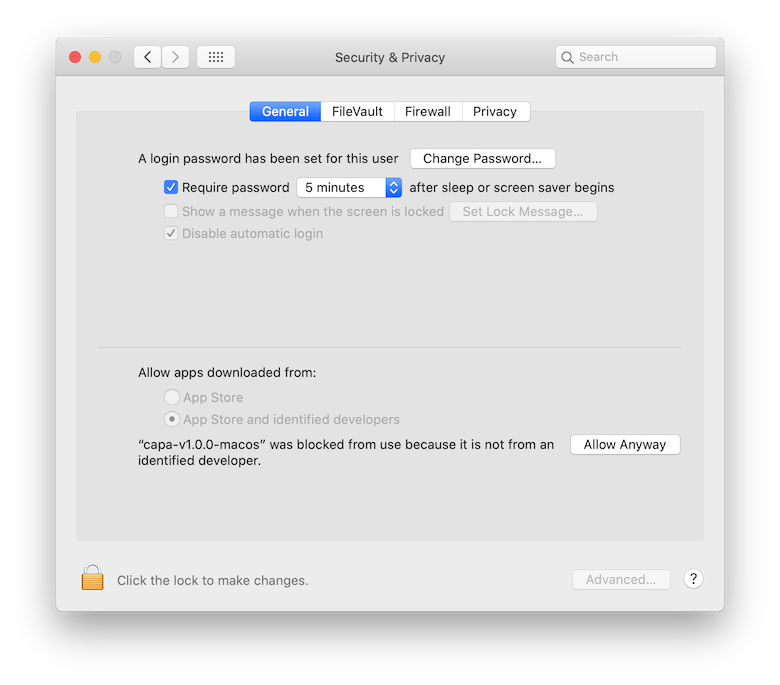

# Installation
You can install capa in a few different ways. First, if you simply want to use capa, just download the [standalone binary](https://github.com/fireeye/capa/releases). If you want to use capa as a Python library, you can install the package directly from GitHub using `pip`. If you'd like to contribute patches or features to capa, you can work with a local copy of the source code.

## Method 1: Standalone installation
If you simply want to use capa, use the standalone binaries we host on GitHub: https://github.com/fireeye/capa/releases. These binary executable files contain all the source code, Python interpreter, and associated resources needed to make capa run. This means you can run it without any installation! Just invoke the file using your terminal shell to see the help documentation.

We use PyInstaller to create these packages.

The capa [README](../README.md#download) also links to nightly builds of standalone binaries from the latest development branch.

### Linux Standalone installation

The Linux Standalone binary has been built using GLIB 2.26.
Consequently it works when using GLIB >= 2.26.
This requirement is satisfied by default in most newer distribution such as Ubuntu >= 18, Debian >= 10, openSUSE >= 15.1 and CentOS >= 8.
But the binary may not work in older distributions.

### MacOS Standalone installation

By default, on MacOS Catalina or greater, Gatekeeper will block execution of the standalone binary. To resolve this, simply try to execute it once on the command-line and then go to `System Preferences` / `Security & Privacy` / `General` and approve the application:

## Method 2: Using capa as a Python library
To install capa as a Python library, you'll need to install a few dependencies, and then use `pip` to fetch the capa module.
Note: this technique doesn't pull the default rule set, so you should check it out separately from [capa-rules](https://github.com/fireeye/capa-rules/) and pass the directory to the entrypoint using `-r`.

### 1. Install capa module
Second, use `pip` to install the capa module to your local Python environment. This fetches the library code to your computer but does not keep editable source files around for you to hack on. If you'd like to edit the source files, see below.
`$ pip install https://github.com/fireeye/capa/archive/master.zip`

### 2. Use capa
You can now import the `capa` module from a Python script or use the IDA Pro plugins from the `capa/ida` directory. For more information please see the [usage](usage.md) documentation.

## Method 3: Inspecting the capa source code
If you'd like to review and modify the capa source code, you'll need to check it out from GitHub and install it locally. By following these instructions, you'll maintain a local directory of source code that you can modify and run easily. 

### 1. Check out source code
Next, clone the capa git repository.
We use submodules to separate [code](https://github.com/fireeye/capa), [rules](https://github.com/fireeye/capa-rules), and [test data](https://github.com/fireeye/capa-testfiles).
To clone everything use the `--recurse-submodules` option:
- `$ git clone --recurse-submodules https://github.com/fireeye/capa.git /local/path/to/src` (HTTPS)
- `$ git clone --recurse-submodules git@github.com:fireeye/capa.git /local/path/to/src` (SSH)

To only get the source code and our provided rules (common), follow these steps:
- clone repository
  - `$ git clone https://github.com/fireeye/capa.git /local/path/to/src` (HTTPS)
  - `$ git clone git@github.com:fireeye/capa.git /local/path/to/src` (SSH)
- `$ cd /local/path/to/src`
- `$ git submodule update rules`

### 2. Install the local source code
Use `pip` to install the source code in "editable" mode. This means that Python will load the capa module from the local directory rather than copying it to `site-packages` or `dist-packages`. This is good because it is easy to modify files and see the effects reflected immediately. But, be careful not to remove this directory unless uninstalling capa.

`$ pip install -e /local/path/to/src`

You'll find that the `capa.exe` (Windows) or `capa` (Linux/MacOS) executables in your path now invoke the capa binary from this directory.

We use the following tools to ensure consistent code style and formatting:
  - [black](https://github.com/psf/black) code formatter, with `-l 120`
  - [isort 5](https://pypi.org/project/isort/) code formatter, with `--profile black --length-sort --line-width 120`
  - [dos2unix](https://linux.die.net/man/1/dos2unix) for UNIX-style LF newlines
  - [capafmt](https://github.com/fireeye/capa/blob/master/scripts/capafmt.py) rule formatter

To install these development dependencies, run:

`$ pip install -e /local/path/to/src[dev]`

Note that some development dependencies (including the black code formatter) require Python 3.

### 3. Setup hooks [optional]

If you plan to contribute to capa, you may want to setup the hooks.
Run `scripts/setup-hooks.sh` to set the following hooks up:
- The `post-commit` hook runs checks after every `git commit`, letting you know if there are code style or rule linter offenses you need to fix.
- The `pre-push` hook runs various style and lint checks as well as the tests. If they do not succeed `git push` is blocked.
  This way you can ensure everything is alright before sending a pull request.
